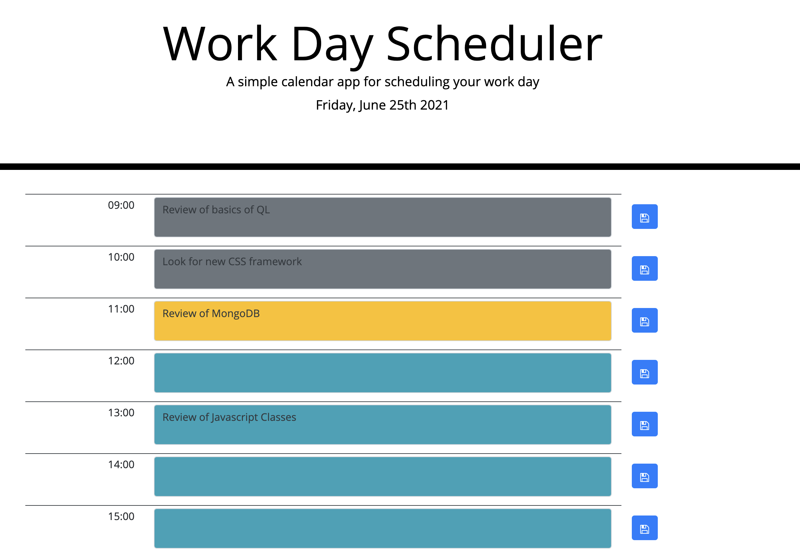

# 05 Third-Party APIs: Work Day Scheduler

## Description

This is a simple application(https://week-05-homework.herokuapp.com/) demonstrating data persistence by giving the user
the option of filling in times during today with tasks, visually showing the current hour, past hours, and future hours.

The user can save the tasks, and they should persist between sessions.

## Technologies

Front-end: jQuery, Moment.js, Javascript, Bootstrap 4

Middleware: Node.js with express and Apollo Server/GraphQL

Data Persistence: MongoDB

## User Story

```md
AS AN employee with a busy schedule I WANT to add important events to a daily planner SO THAT I can manage my time
effectively
```

## Acceptance Criteria

```md
GIVEN I am using a daily planner to create a schedule WHEN I open the planner THEN the current day is displayed at the
top of the calendar WHEN I scroll down THEN I am presented with timeblocks for standard business hours WHEN I view the
timeblocks for that day THEN each timeblock is color coded to indicate whether it is in the past, present, or future
WHEN I click into a timeblock THEN I can enter an event WHEN I click the save button for that timeblock THEN the text
for that event is saved in persistent storage WHEN I refresh the page THEN the saved events persist
```

The following demonstrates the application screenshot:



